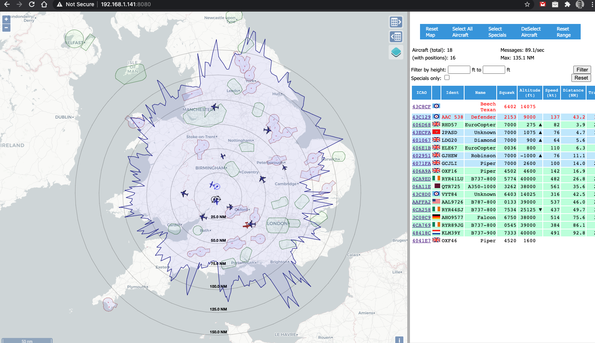
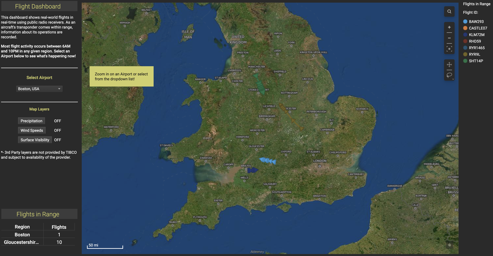

# dump1090toTIBCOStreamingBridge

This Golang application takes ADS-B data received using the dump1090-fa application (https://github.com/adsbxchange/dump1090-fa) listens to the raw SBS output port and then sends the data to TIBCO Streaming (Streambase LiveView) for real-time visualisation.

## Hardware
To get started - you'll need the appropriate ADS-B receiver kit, antenna and dump1090 running. I chose to get my receiver kit set up on a Raspberry Pi - and in general, I followed the instructions available from FlightAware: (https://uk.flightaware.com/adsb/piaware/build)

Once you have your hardware up and running, and you can see flights being tracked on the local web user interface, then you know that dump1090-fa is running too.



## Antenna

You **REALLY** want to look at your Antenna setup. The stock antenna's generally aren't "tuned" correctly for the frequency that the ADS-B signals are sent by. It's incredibly easy to make your own though. There are a lot of resources that discuss how to make antennas. Here's a really good discussion forum: (https://discussions.flightaware.com/t/three-easy-diy-antennas-for-beginners/16348/55)

I made both the "Spider" Antenna and a Slim Jim Antenna - in testing both were far more sensitive than the stock antenna, and I eventually opted for a Slim Jim antenna - as I could mount it outside and I've managed to get it as high as possible up the side of the house, and the cables/antenna are hidden from general view.

The higher you can get your antenna, the better! To make a Slim Jim Antenna - again there are lots of resources such as: (https://jeroen.steeman.org/Antenna/Slim-Jim-Antenna-Calculator).

In calculators - you need to use 1090mhz as the frequency. I can get pretty decent range. The graph below is a customised version of the dump1090-fa application (as described in the flightaware blog), that shows the maximum range that I have received ADS-B signals. I live ~10 miles away from a local airport, so I get lots of private plane transmissions, helicopters etc.

I can also receive transmissions from aircraft at 40,000 feet from upto 150 miles away fairly regularly. I also live relatively close (~30 miles) to a couple of RAF bases and the main flight path for a number of RAF and USAF planes is right above my house, which I never realised until I set this up! Every now and then, I have seen aircraft from 250 miles - but that's rare.

## Building and Running
Once you've cloned the repository, you can build the application using the following command on your target environment:
```
go build .
```
Once built, you can execute the appliction using a command line such as:
```
./dump1090toTIBCOStreamingBridge --dump1090URL localhost:30003 --streamingHostURL <URL> -streamingHostUsername <USERNAME> --streamingHostPassword <PASSWORD> --region UK --sourceID JohnSmith
```

--dump1090URL needs to point to the machine and port where dump1090-fa is running. Port 30003 is the default port for the raw SBS format data http://woodair.net/sbs/article/barebones42_socket_data.htm

--streamingHostURL should point to your TIBCO Streaming (LiveView) endpoint. e.g. https://xyz.com:443/lv/api/v1/tables/PlanesPublish/tuples

--region and --sourceID are used as text fields that you could use to filter/sort data

## Viewing results

My data is being sent to the TIBCO Spotfire Real Time Flight Tracker demo that can be found at the following link: 
https://www.tibco.com/products/tibco-spotfire/learn/demos/real-time-flight-tracker



You can of course build your own Dashboards using TIBCO Streaming (https://www.tibco.com/products/tibco-streaming)